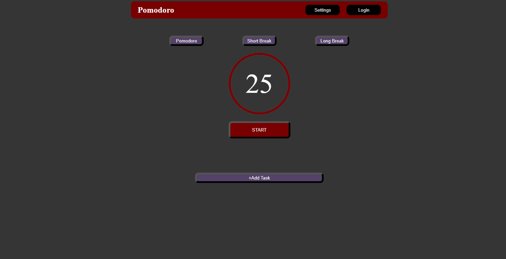
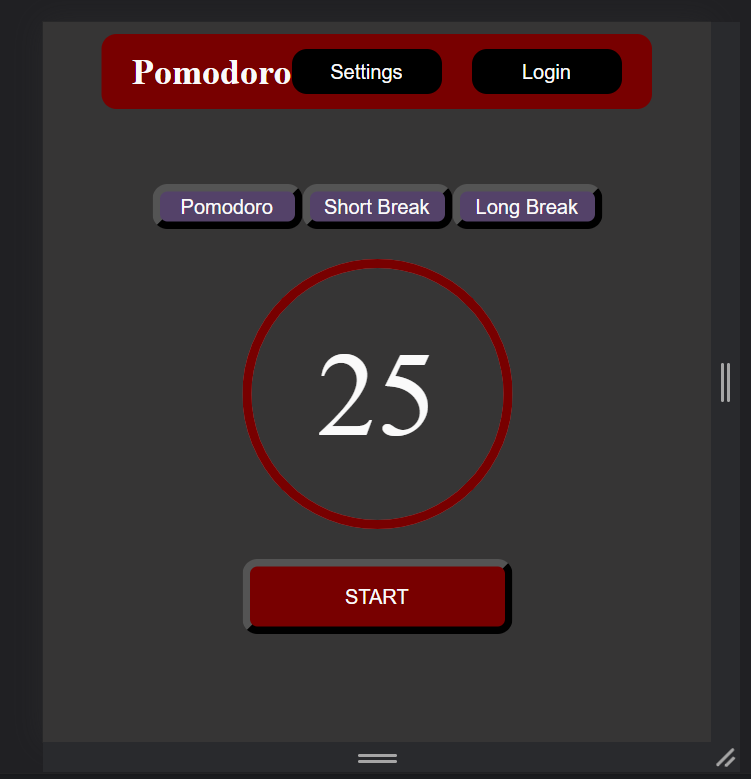

# Pomodoro Timer App

## Building software that keeps me focused. 

This the a picture of the desktop view. Change the lenght of time for pomotime, short, and long breaks in the settings tab.  

### Desktop view

This is a mobile view of the app. I am still working on getting the mobile view. I will add hamburger menus and work with the pomotime, short, and long break buttons. 

Still need to add login and add task features. However the pomodoro timer feature is working. The user can set the time, reset the time, change from short break and long break. I will be building the back end soon the add task feature.  

### Mobile View
