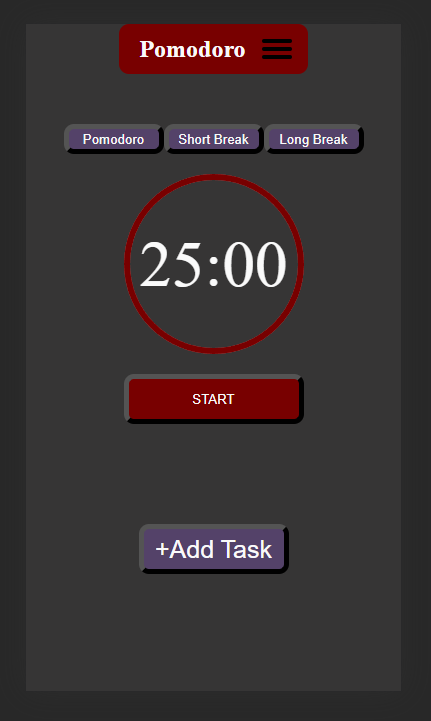

# Pomodoro Timer App

## Building software that keeps me focused. 

This the a picture of the desktop view. Change the lenght of time for pomotime, short, and long breaks in the settings tab.  

### Desktop view

This is a mobile view of the app. I am still working on getting the mobile view. I will add hamburger menus and work with the pomotime, short, and long break buttons. 

Still need to add login and add task features. However the pomodoro timer feature is working. The user can set the time, reset the time, change from short break and long break. I will be building the back end soon the add task feature.  

### Mobile View

### Updates

The add task works. I added some security validation to the input field to prevent special charters being added with an alert to the user that special characters may not be used when creating tasks. 

The backend branch was started and soon I will convert the app to a full stack application with log in features. The front-end portion is mostly finished with some minor updates to the mobile UI design remaining. The app works as intended as a frontend application now the transition from frontend to full stack is next. 

Started converting the app to use redux. Finshed with installing packages needed for redux-toolkit. START PAUSE button now works in redux. I will be converting each feature one by one to redux to update the app to a more modern state managment system. 
